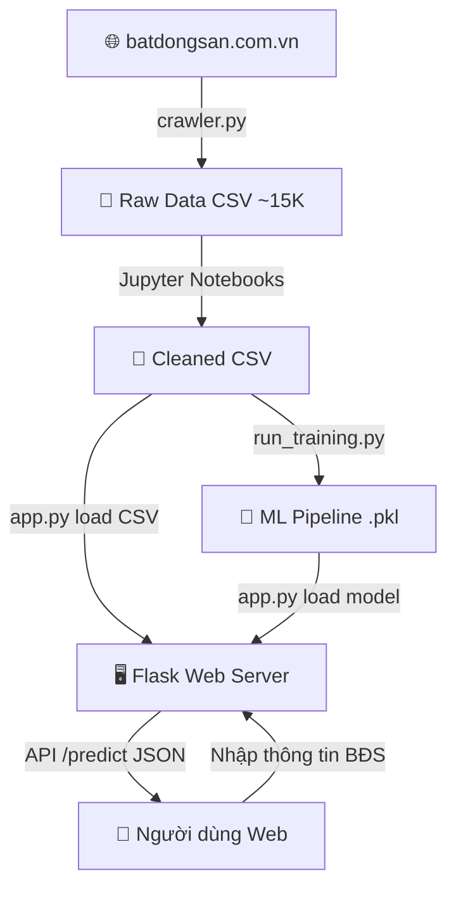

# TÀI LIỆU BẢO VỆ — PHẦN 1: KIẾN TRÚC & THUẬT TOÁN
# HỆ THỐNG DỰ ĐOÁN GIÁ BẤT ĐỘNG SẢN (ProphetEstate)

---

## 1. TỔNG QUAN & KIẾN TRÚC HỆ THỐNG

### 1.1 Hệ thống làm gì?
ProphetEstate là hệ thống **định giá bất động sản thông minh** sử dụng Machine Learning. Người dùng nhập thông tin căn nhà (diện tích, quận, hướng, pháp lý...), hệ thống AI dự đoán giá trị ước tính bằng tiền tỷ VNĐ.

**Bài toán**: Regression (Hồi quy) — dự đoán giá trị liên tục (giá nhà) từ các đặc trưng đầu vào.

### 1.2 Sơ đồ kiến trúc (Mermaid)



**3 giai đoạn chính**:
1. **Thu thập** → `crawler.py` cào ~15.000 tin BĐS từ batdongsan.com.vn
2. **Huấn luyện** → `run_training.py` train 4 thuật toán, chọn best model
3. **Phục vụ** → `app.py` (Flask) load model, nhận input, trả kết quả

### 1.3 Tech Stack

| Thành phần | Công nghệ | Lý do kỹ thuật |
|---|---|---|
| Ngôn ngữ | Python 3 | Hệ sinh thái ML phong phú nhất |
| ML | scikit-learn + XGBoost | Pipeline chuẩn hóa; XGBoost là SOTA cho tabular data |
| Backend | Flask | Nhẹ, phù hợp prototype |
| Crawling | curl_cffi + BeautifulSoup | curl_cffi giả lập Chrome chống anti-bot |
| Frontend | HTML/CSS/JS + Jinja2 | Server-side rendering đơn giản |
| Chart | Chart.js + Matplotlib | Interactive trên web + static khi training |
| Storage | CSV + Pickle | Đơn giản, serialize Pipeline 1 file |

---

## 2. TRÁI TIM CỦA HỆ THỐNG THÔNG MINH

### 2.1 Thông minh ở đâu?

1. **Supervised ML (Hồi quy có giám sát)**: Train trên ~12.000 mẫu thực tế
2. **Ensemble Learning**: XGBoost = Gradient Boosted Trees (300 cây tuần tự)
3. **Explainable AI (XAI)**: Feature Importance — giải thích TẠI SAO giá cao/thấp
4. **Content-Based Recommendation**: Gợi ý BĐS tương tự ±20% giá

### 2.2 So sánh 4 thuật toán

| Thuật toán | Loại | Hyperparameters chính |
|---|---|---|
| Linear Regression | Baseline | Không có |
| Decision Tree | Cây quyết định | max_depth=10, min_samples_split=5 |
| Random Forest | Bagging (200 cây) | max_depth=15, min_samples_split=4 |
| **XGBoost** ★ | **Boosting (300 cây)** | **learning_rate=0.05, max_depth=7, subsample=0.8** |

### 2.3 Luồng Input → Processing → Output

```
INPUT (người dùng nhập):
  area_m2=65, bedrooms=2, district="Cầu Giấy",
  direction="Đông-Nam", furniture="Đầy đủ", legal="Sổ đỏ", loai_bds="chung_cu"

PREPROCESSING (tự động trong Pipeline):
  ├── StandardScaler → chuẩn hóa 5 cột số (z = (x-mean)/std)
  └── OneHotEncoder → 5 cột categorical → vector nhị phân
      VD: district="Cầu Giấy" → [0,1,0,0,...,0]

XGBoost PREDICTION:
  └── 300 cây boosted → tổng hợp → giá trị dự đoán

OUTPUT:
  price_billion=3.45, price_low=2.60, price_high=4.30,
  contributions=[{feature:"Diện tích", impact:1.38}],
  similar_properties=[{title:"...", price:3.2}]
```

### 2.4 Pipeline tiền xử lý — TẠI SAO quan trọng?

```python
preprocessor = ColumnTransformer(transformers=[
    ('num', StandardScaler(), numeric_features),      # Chuẩn hóa số
    ('cat', OneHotEncoder(handle_unknown='ignore'), categorical_features)  # Mã hóa phân loại
])
pipeline = Pipeline(steps=[('preprocessor', preprocessor), ('model', XGBRegressor(...))])
```

- **Pipeline** đảm bảo dữ liệu mới được xử lý Y HỆT lúc train → tránh data leakage
- **handle_unknown='ignore'**: Nếu user nhập quận chưa có trong training data → không crash
- **Serialize 1 file**: `pickle.dump(pipeline)` → deploy chỉ cần 1 file `.pkl`

### 2.5 Cách tính XAI (Explainable AI)

```python
# Công thức: impact_i = predicted_price × (feature_importance_i / total_importance)
ratio = feature_importance[i] / total_importance
impact = prediction_billion * ratio
# → Mỗi feature đóng góp bao nhiêu tỷ vào giá cuối cùng
```

Ví dụ: Dự đoán = 3.45 tỷ, area_m2 có importance 40% → impact = 3.45 × 0.4 = 1.38 tỷ

---

## 3. GIẢI PHẪU SOURCE CODE

### 3.1 Cấu trúc thư mục

```
house-price-prediction/
├── app/
│   ├── app.py              ★ Flask backend (858 dòng)
│   ├── static/
│   │   ├── script.js        ★ Frontend logic (493 dòng)
│   │   ├── style.css         Design system
│   │   └── style-override.css Layout styles
│   └── templates/            12 template files (Jinja2)
├── data/
│   ├── crawl/crawler.py     ★ Web scraper (368 dòng)
│   ├── raw/raw_data.csv      Dữ liệu thô
│   └── processed/            2 CSV đã clean
├── models/
│   ├── best_model_pipeline.pkl ★ Model (1.5MB)
│   └── model_meta.pkl        Metrics + Feature Importance
├── notebooks/                4 Jupyter notebooks (EDA→Train→Eval)
├── run_training.py          ★ Training pipeline (261 dòng)
└── requirements.txt
```

### 3.2 Top 5 file quan trọng

**★ File 1: `run_training.py`** — Pipeline huấn luyện hoàn chỉnh
- Load data → Gộp 2 loại BĐS → Lọc outlier (giá 1-200 tỷ, DT 10-1000m²)
- Train 4 model với Pipeline, đánh giá RMSE/MAE/R²/MAPE
- Cross-Validation 5-Fold kiểm chứng
- Export `best_model_pipeline.pkl` + `model_meta.pkl`

**★ File 2: `app/app.py`** — Web server + API dự đoán
- Load model 1 lần khi khởi động (Singleton Pattern)
- API `/predict`: nhận JSON → tạo DataFrame → model.predict() → trả kết quả + XAI
- Tìm BĐS tương tự trong CSV (±20% giá, ưu tiên cùng quận)
- Auth (login/register/Google OAuth), profile, history, saved

**★ File 3: `data/crawl/crawler.py`** — Thu thập dữ liệu
- Cào từ 26 danh mục BĐS (HN, HCM, ĐN, BD, HP...)
- Chống ban: curl_cffi giả lập Chrome, random sleep, auto refresh session
- Resume mode: đọc file cũ, chỉ cào thêm phần thiếu
- Dedup 2 lớp: URL + listing_id

**★ File 4: `app/static/script.js`** — Xử lý frontend
- Submit form → fetch API → animate kết quả (count up)
- Render XAI bars, similar properties, district comparison badge
- Auth modal (login/register), page transitions

**★ File 5: `app/templates/analytics.html`** — Dashboard phân tích
- Trực quan hóa dữ liệu bằng Chart.js (bar, doughnut)
- KPI cards, bảng xếp hạng giá theo quận
