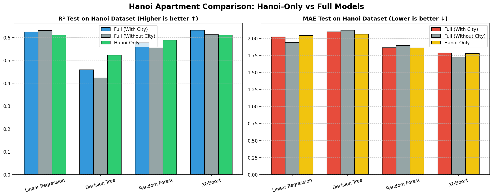
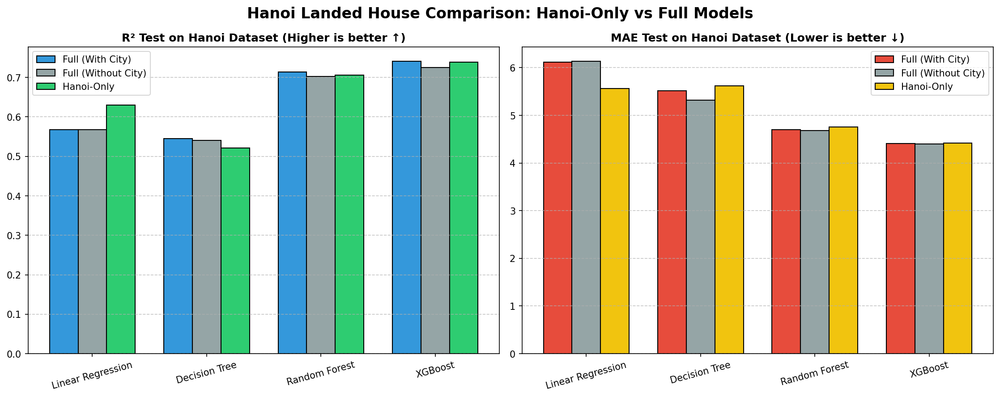

# Báo cáo Thực nghiệm: So sánh Mô hình Chuyên biệt Hà Nội (Hanoi-Only) vs Mô hình Toàn quốc (Full Models)

## 1. Giới thiệu thử nghiệm
Thử nghiệm này được thực hiện nhằm đánh giá độ chính xác khi dự đoán giá bất động sản **riêng tại Hà Nội** giữa mô hình được huấn luyện chuyên biệt và mô hình toàn quốc.
- **Chung cư Hà Nội**: Huấn luyện trên 875 mẫu và kiểm thử trên 219 mẫu local sạch (đã lọc outliers).
- **Nhà đất Hà Nội**: Huấn luyện trên 2174 mẫu và kiểm thử trên 544 mẫu local sạch (đã lọc outliers).

Cả 3 mô hình (Full có City, Full không City, và Hanoi-Only) được đánh giá trên **cùng tập Test Hà Nội** để đảm bảo tính khách quan khoa học, không rò rỉ dữ liệu.

## 2. Kết quả đối chiếu chi tiết: Mô hình CHUNG CƯ HÀ NỘI

| Thuật toán | Cấu hình | R² Test | RMSE (tỷ) | MAE (tỷ) | MAPE | CV R² Mean |
| :--- | :--- | :---: | :---: | :---: | :---: | :---: |
| **Linear Regression** | Hanoi-Only | 0.6109 | 3.0104 | 2.0448 | 26.3% | 0.7218 ± 0.0352 |
| | Full (Có City) | 0.6238 | 2.9599 | 2.0234 | 25.8% | 0.6280 ± 0.0082 |
| | Full (Không City) | 0.6312 | 2.9307 | 1.9416 | 23.7% | 0.6250 ± 0.0100 |
| | *Độ lệch (HN vs Full+City)* | *-0.0129* | *+0.0505* | *+0.0214* | *+0.5%* | |
| | | | | | | |
| **Decision Tree** | Hanoi-Only | 0.5226 | 3.3345 | 2.0622 | 24.5% | 0.6654 ± 0.0740 |
| | Full (Có City) | 0.4592 | 3.5490 | 2.0989 | 24.8% | 0.5885 ± 0.0407 |
| | Full (Không City) | 0.4230 | 3.6658 | 2.1195 | 23.4% | 0.5667 ± 0.0487 |
| | *Độ lệch (HN vs Full+City)* | *+0.0634* | *-0.2145* | *-0.0367* | *-0.3%* | |
| | | | | | | |
| **Random Forest** | Hanoi-Only | 0.5880 | 3.0976 | 1.8633 | 21.7% | 0.7557 ± 0.0394 |
| | Full (Có City) | 0.5782 | 3.1342 | 1.8635 | 21.8% | 0.6822 ± 0.0341 |
| | Full (Không City) | 0.5543 | 3.2218 | 1.8970 | 21.7% | 0.6711 ± 0.0365 |
| | *Độ lệch (HN vs Full+City)* | *+0.0098* | *-0.0365* | *-0.0002* | *-0.1%* | |
| | | | | | | |
| **XGBoost** | Hanoi-Only | 0.6109 | 3.0103 | 1.7793 | 20.5% | 0.7760 ± 0.0343 |
| | Full (Có City) | 0.6313 | 2.9302 | 1.7874 | 21.0% | 0.6894 ± 0.0326 |
| | Full (Không City) | 0.6126 | 3.0038 | 1.7256 | 19.5% | 0.6888 ± 0.0292 |
| | *Độ lệch (HN vs Full+City)* | *-0.0204* | *+0.0802* | *-0.0081* | *-0.6%* | |
| | | | | | | |

## 3. Kết quả đối chiếu chi tiết: Mô hình NHÀ ĐẤT HÀ NỘI

| Thuật toán | Cấu hình | R² Test | RMSE (tỷ) | MAE (tỷ) | MAPE | CV R² Mean |
| :--- | :--- | :---: | :---: | :---: | :---: | :---: |
| **Linear Regression** | Hanoi-Only | 0.6300 | 9.3588 | 5.5625 | 36.9% | 0.6202 ± 0.0684 |
| | Full (Có City) | 0.5681 | 10.1115 | 6.1180 | 41.0% | 0.5732 ± 0.0209 |
| | Full (Không City) | 0.5677 | 10.1158 | 6.1296 | 41.3% | 0.5742 ± 0.0220 |
| | *Độ lệch (HN vs Full+City)* | *+0.0619* | *-0.7527* | *-0.5555* | *-4.1%* | |
| | | | | | | |
| **Decision Tree** | Hanoi-Only | 0.5213 | 10.6446 | 5.6165 | 34.4% | 0.5449 ± 0.0519 |
| | Full (Có City) | 0.5454 | 10.3729 | 5.5165 | 34.4% | 0.6069 ± 0.0485 |
| | Full (Không City) | 0.5405 | 10.4286 | 5.3143 | 31.1% | 0.5349 ± 0.0502 |
| | *Độ lệch (HN vs Full+City)* | *-0.0241* | *+0.2716* | *+0.0999* | *+0.1%* | |
| | | | | | | |
| **Random Forest** | Hanoi-Only | 0.7057 | 8.3458 | 4.7524 | 28.1% | 0.7041 ± 0.0388 |
| | Full (Có City) | 0.7137 | 8.2318 | 4.6961 | 27.8% | 0.7239 ± 0.0267 |
| | Full (Không City) | 0.7024 | 8.3934 | 4.6838 | 27.1% | 0.7079 ± 0.0246 |
| | *Độ lệch (HN vs Full+City)* | *-0.0080* | *+0.1141* | *+0.0563* | *+0.3%* | |
| | | | | | | |
| **XGBoost** | Hanoi-Only | 0.7391 | 7.8578 | 4.4163 | 26.3% | 0.6957 ± 0.0399 |
| | Full (Có City) | 0.7405 | 7.8373 | 4.4097 | 26.7% | 0.7540 ± 0.0286 |
| | Full (Không City) | 0.7256 | 8.0593 | 4.4015 | 26.7% | 0.7473 ± 0.0380 |
| | *Độ lệch (HN vs Full+City)* | *-0.0014* | *+0.0205* | *+0.0066* | *-0.4%* | |
| | | | | | | |

## 4. Trực quan hóa biểu đồ
### A. Biểu đồ Chung cư Hà Nội

### B. Biểu đồ Nhà đất Hà Nội

## 5. Nhận xét & Kết luận chuyên sâu (Lý giải khoa học)

