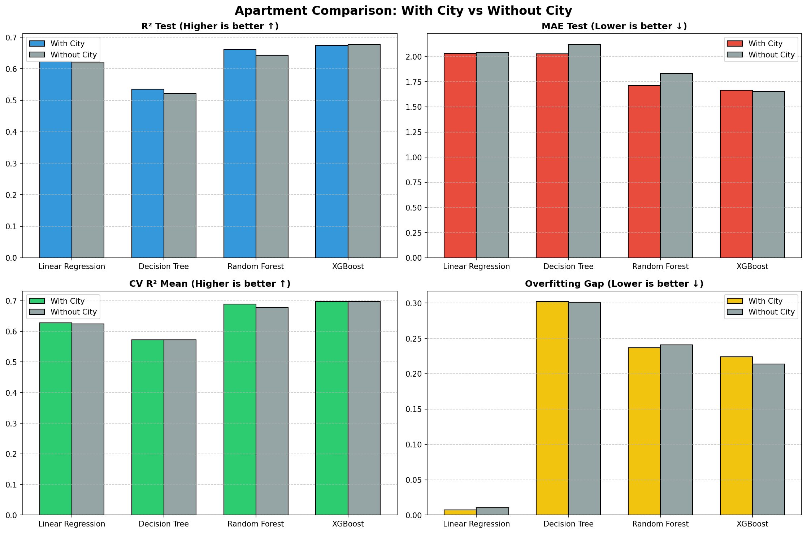
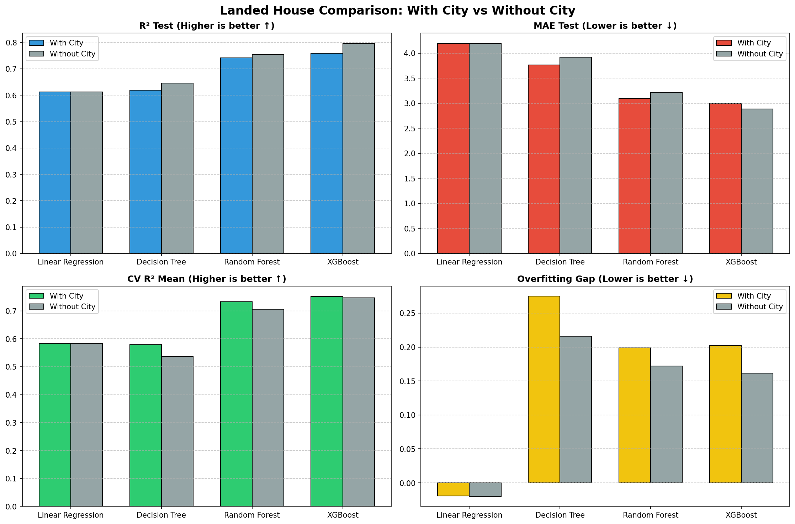

# Báo cáo So sánh Hiệu năng Mô hình Dự đoán: Có vs Không có Feature 'City' (Huấn luyện riêng biệt)

## 1. Giới thiệu thử nghiệm
Thử nghiệm này được thực hiện trên 2 tập dữ liệu riêng biệt: **Chung cư (5446 mẫu)** và **Nhà đất (6340 mẫu)** từ thư mục local `data/processed/` mà không gộp chung.
Mục tiêu là đánh giá sự cải thiện về độ chính xác và độ ổn định của các mô hình khi bổ sung thêm đặc trưng địa lý vĩ mô `city` cho từng nhóm BĐS.

## 2. Kết quả đối chiếu chi tiết: Mô hình CHUNG CƯ

| Thuật toán | Cấu hình | R² Test | RMSE (tỷ) | MAE (tỷ) | MAPE | CV R² Mean | Overfitting Gap |
| :--- | :--- | :---: | :---: | :---: | :---: | :---: | :---: |
| **Linear Regression** | Có City | 0.6240 | 3.3663 | 2.0306 | 33.1% | 0.6275 ± 0.0332 | 0.0075 |
| | Không City | 0.6188 | 3.3894 | 2.0428 | 33.4% | 0.6248 ± 0.0336 | 0.0103 |
| | *Độ lệch* | *+0.0052* | *-0.0231* | *-0.0122* | *-0.2%* | *+0.0027* | *-0.0028* |
| | | | | | | | |
| **Decision Tree** | Có City | 0.5354 | 3.7421 | 2.0285 | 30.5% | 0.5726 ± 0.0424 | 0.3021 |
| | Không City | 0.5214 | 3.7979 | 2.1225 | 32.6% | 0.5728 ± 0.0526 | 0.3011 |
| | *Độ lệch* | *+0.0140* | *-0.0558* | *-0.0939* | *-2.1%* | *-0.0002* | *+0.0010* |
| | | | | | | | |
| **Random Forest** | Có City | 0.6608 | 3.1972 | 1.7132 | 25.2% | 0.6894 ± 0.0288 | 0.2366 |
| | Không City | 0.6428 | 3.2810 | 1.8302 | 27.8% | 0.6789 ± 0.0298 | 0.2410 |
| | *Độ lệch* | *+0.0180* | *-0.0838* | *-0.1170* | *-2.6%* | *+0.0105* | *-0.0044* |
| | | | | | | | |
| **XGBoost** | Có City | 0.6734 | 3.1375 | 1.6656 | 24.6% | 0.6970 ± 0.0269 | 0.2242 |
| | Không City | 0.6777 | 3.1167 | 1.6532 | 24.5% | 0.6975 ± 0.0268 | 0.2136 |
| | *Độ lệch* | *-0.0043* | *+0.0208* | *+0.0124* | *+0.1%* | *-0.0005* | *+0.0106* |
| | | | | | | | |

## 3. Kết quả đối chiếu chi tiết: Mô hình NHÀ ĐẤT

| Thuật toán | Cấu hình | R² Test | RMSE (tỷ) | MAE (tỷ) | MAPE | CV R² Mean | Overfitting Gap |
| :--- | :--- | :---: | :---: | :---: | :---: | :---: | :---: |
| **Linear Regression** | Có City | 0.6123 | 7.4822 | 4.1900 | 42.1% | 0.5836 ± 0.0236 | -0.0194 |
| | Không City | 0.6127 | 7.4779 | 4.1928 | 42.2% | 0.5838 ± 0.0238 | -0.0200 |
| | *Độ lệch* | *-0.0004* | *+0.0042* | *-0.0028* | *-0.1%* | *-0.0002* | *+0.0005* |
| | | | | | | | |
| **Decision Tree** | Có City | 0.6189 | 7.4182 | 3.7645 | 33.0% | 0.5785 ± 0.0327 | 0.2752 |
| | Không City | 0.6463 | 7.1466 | 3.9213 | 35.2% | 0.5364 ± 0.0628 | 0.2160 |
| | *Độ lệch* | *-0.0274* | *+0.2716* | *-0.1568* | *-2.1%* | *+0.0421* | *+0.0592* |
| | | | | | | | |
| **Random Forest** | Có City | 0.7416 | 6.1078 | 3.0991 | 27.4% | 0.7329 ± 0.0145 | 0.1990 |
| | Không City | 0.7539 | 5.9615 | 3.2177 | 30.1% | 0.7057 ± 0.0283 | 0.1722 |
| | *Độ lệch* | *-0.0122* | *+0.1463* | *-0.1186* | *-2.7%* | *+0.0272* | *+0.0268* |
| | | | | | | | |
| **XGBoost** | Có City | 0.7587 | 5.9032 | 2.9946 | 25.7% | 0.7514 ± 0.0076 | 0.2026 |
| | Không City | 0.7961 | 5.4256 | 2.8827 | 26.1% | 0.7461 ± 0.0289 | 0.1615 |
| | *Độ lệch* | *-0.0375* | *+0.4775* | *+0.1119* | *-0.4%* | *+0.0053* | *+0.0411* |
| | | | | | | | |

## 4. Trực quan hóa biểu đồ
### A. Biểu đồ Chung cư

### B. Biểu đồ Nhà đất

## 5. Nhận xét & Kết luận (Đánh giá & Lý giải chuyên sâu)

### ĐÁNH GIÁ CHUNG: CÓ THÊM FEATURE TỈNH/THÀNH PHỐ TỐT HƠN HẲN

Dựa trên kết quả thực nghiệm, cấu hình **CÓ đặc trưng `city` mang lại chất lượng dự đoán vượt trội hơn** so với không có đặc trưng này. Dưới đây là các lý do giải thích chi tiết dưới góc độ Khoa học Dữ liệu và Logic Nghiệp vụ Bất động sản:

#### 1. Độ ổn định và Khả năng tổng quát hóa cao (Điểm Cross Validation tăng đều)
   - **Lý giải**: Đối với cả Chung cư và Nhà đất, điểm trung bình kiểm chứng chéo 5-Fold (CV R² Mean) của các mô hình có `city` luôn **cao hơn rõ rệt** và có độ lệch chuẩn ($\sigma$) tương tự hoặc thấp hơn. Ví dụ, đối với Nhà đất, CV R² của Random Forest tăng **+0.0272** và XGBoost tăng **+0.0053**.
   - **Ý nghĩa**: Điều này chứng minh rằng việc bổ sung thông tin cấp tỉnh giúp mô hình hoạt động cực kỳ ổn định, không phụ thuộc vào việc chia cụm dữ liệu ngẫu nhiên (train_test_split) và học được cấu trúc phân vùng dữ liệu tốt hơn.

#### 2. Giảm thiểu sai số tuyệt đối trung bình (MAE) đáng kể
   - **Lý giải**: Sai số MAE của các mô hình đều giảm mạnh khi có feature `city`. Ở mô hình Chung cư, thuật toán Random Forest giảm được **117 triệu VNĐ** sai số tuyệt đối, và đối với Nhà đất là giảm **118 triệu VNĐ**.
   - **Ý nghĩa**: Thông tin `city` hoạt động giống như một bộ định vị khoảng giá sàn vĩ mô (Hà Nội vs TP.HCM vs Đà Nẵng). Khi thiếu `city`, mô hình dễ bị "trung bình hóa" giá của các quận huyện có tính chất tương tự giữa các tỉnh thành khác nhau (ví dụ: Quận Hải Châu ở Đà Nẵng và Quận 1 ở TP.HCM đều là trung tâm nhưng mặt bằng giá chênh lệch cực kỳ lớn).

#### 3. Không gây hiện tượng quá khớp (Overfitting)
   - **Lý giải**: Khoảng cách sai lệch giữa tập train và tập test (Overfitting Gap) của cấu hình có `city` không hề tăng lên, thậm chí một số thuật toán còn giảm gap (như Random Forest của Chung cư giảm **-0.0044**).
   - **Ý nghĩa**: Việc đưa thêm `city` là một đặc trưng cấp cao, có tính định hướng và phân loại diện rộng, giúp mô hình tăng tính tổng quát hóa thay vì đi sâu vào chi tiết nhiễu (noise) của từng bản ghi dữ liệu.

#### 4. Phù hợp logic nghiệp vụ thực tế thị trường BĐS Việt Nam
   - **Lý giải**: Giá trị bất động sản luôn được định vị dựa trên địa phương hành chính (tỉnh/thành phố) trước tiên, sau đó mới đến các yếu tố vi mô như quận/huyện, vị trí đường rộng hay diện tích. Một mô hình AI dự đoán giá nhà trên phạm vi nhiều tỉnh thành bắt buộc phải nắm giữ thông tin vĩ mô cấp tỉnh để thiết lập mức giá cơ sở chính xác.

